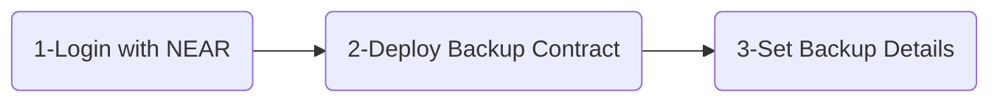
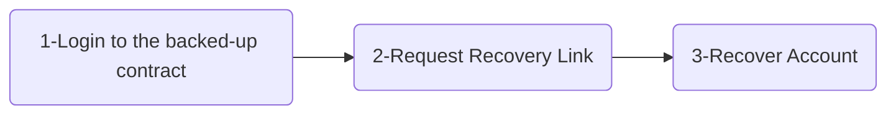

# Save Sation

**Never lose access to your account!**

Allow another account to gain access to yours when you are dead! or if you lose access for any reason. Backup and recovery in three simple steps.

## NEAR Account Backup Steps

### 1-Login with NEAR
Login will ask you for a full access key. SaveStation smart contract is [locked](https://explorer.testnet.near.org/accounts/savestation.testnet), that means no one have access to your data even us, the developers. We need the full access to be able to deploy the backup contract. 

You can view the contract details [here](https://stats.gallery/testnet/savestation.testnet/contract?t=all).

 ### 2-Deploy Backup Contract
SaveStation requires some code to be deployed into your account to allow the recovery process later. It's a click of a button. [This is the contract we deploy to your account](https://github.com/azmasamy/save-station/blob/main/contracts/recovery_contract/assembly/index.ts). 

### 3-Set Backup Details
Set the the NEAR recovery account that will be able to recover your account after a certain date you specify. You can change it anytime.

## NEAR Account Recovery Steps

### 1-Login to Account
Whoever is authorized to recover the account will request login to the backed-up account that needs to be recovered. This will let you get the recovery link **if you are authorzed by the owner** 

### 2-Request Recovery
Request a magical link that lets you recover the backed-up account, only if you are allowed to.

### 3-Recover Account
Use the magical link to gain access to the backed-up account. Open it in your browser.
