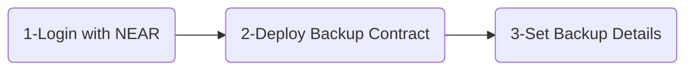
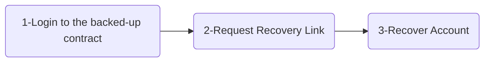

# Save Sation

**Never lose access to your account!**

Allow another account to gain access to yours when you are dead! or if you lose access for any reason. Backup and recovery in three simple steps.

## NEAR Account Backup Steps

### 1-Login with NEAR
SaveStation smart contract is  [locked](https://explorer.testnet.near.org/accounts/savestation.testnet), that means no one have access to your data even us, the developers. Login to start the backup process.

 ### 2-Deploy Backup Contract
SaveStation requires some code to be deployed into your account to allow the recovery process later. It's a click of a button.

### 3-Set Backup Details
Set the the NEAR recovery account that will be able to recover your account after a certain date you specify. You can change it anytime.

## NEAR Account Recovery Steps

### 1-Login to Account
Request login to the backed-up account you want to recover.

### 2-Request Recovery
Request a magical link that lets you recover the backed-up account, only if you are allowed to.

### 3-Recover Account
Use the magical link to gain access to the backed-up account.
